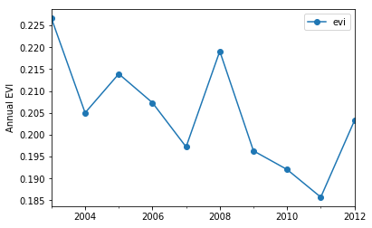

# Accessing data through ORNL DAAC web services

*Author: Rupesh Shrestha*  
*Date: March 21, 2018*  
*Contact for ORNL DAAC: uso@daac.ornl.gov*

### Keywords: web service, SOAP, Python, OGC, RESTful API, MODIS, Daymet, SDAT

## Overview

ORNL DAAC offers various tools and web services which allow programmatic access of the data (https://daac.ornl.gov/tools/). In this tutorial, we will use different web services to access and combine datasets near Deep Creek Ridge in Central Idaho **(lat = 45.0949, lon = -114.1086)**. There was a significant tree mortality due to bark beetles during 2009-2011 period (see https://daac.ornl.gov/cgi-bin/dsviewer.pl?ds_id=1512).

## Source Data
This tutorial uses following web services:
* [MODIS web service](https://modis.ornl.gov/data/modis_webservice.html), a [SOAP](https://en.wikipedia.org/wiki/SOAP)-based service, to access [MODIS Land Products](https://modis.ornl.gov/documentation.html).
* [Daymet single-pixel tool](https://daymet.ornl.gov/web_services.html), a [REST](https://en.wikipedia.org/wiki/Representational_state_transfer)-ful web service to download daily weather parameters at a single geographic point.
* [Spatial Data Access Tools - SDAT](https://webmap.ornl.gov/ogc), an [OGC](http://www.opengeospatial.org/)-based web service to visualize and download spatial data in various user-selected spatial/temporal extents and formats.

## Prerequisites

Python 2.7 or later. Python modules: numpy, pandas, matplotlib, urllib, zeep, owslib

## Procedure

You can access the Jupyter Notebook [here](webservice_modis_daymet_sdat.ipynb).
